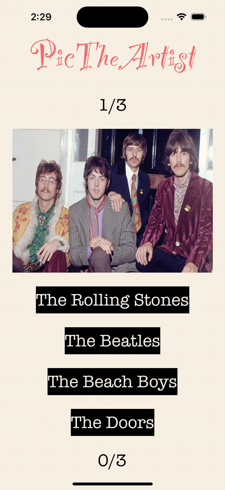
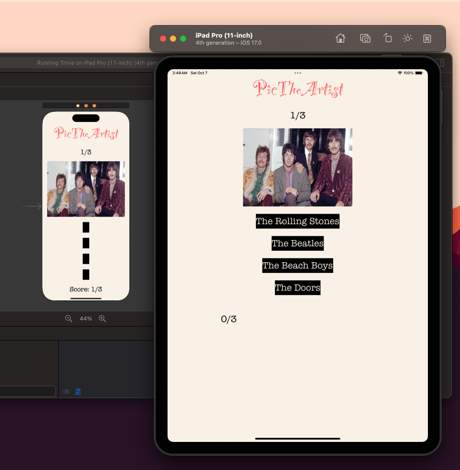

# Project 3 - *PicTheArtist*

Submitted by: **Vasanth Banumurthy**

**PicTheArtist** is a trivia app that tests if you know music artists by their faces.

Time spent: **6** hours spent in total

## Required Features

The following **required** functionality is completed:

- [X] User can view the current question and 4 different answers
- [X] User can view the next question after tapping an answer
- [X] User can answer at least 3 different questions

The following **optional** features are implemented:

- [X] User can use the vertical orientation of the app on any device
      
- [X] User can track the question they are on and how many questions are left
- [X] User can see how many questions they got correct after answering all questions
- [ ] User should be able to restart the game after they've finished answering all questions

The following **additional** features are implemented:

- [ ] List anything else that you can get done to improve the app functionality!

## Demo Solution

## Notes

Describe any challenges encountered while building the app.

## License

    Copyright [yyyy] [name of copyright owner]

    Licensed under the Apache License, Version 2.0 (the "License");
    you may not use this file except in compliance with the License.
    You may obtain a copy of the License at

        http://www.apache.org/licenses/LICENSE-2.0

    Unless required by applicable law or agreed to in writing, software
    distributed under the License is distributed on an "AS IS" BASIS,
    WITHOUT WARRANTIES OR CONDITIONS OF ANY KIND, either express or implied.
    See the License for the specific language governing permissions and
    limitations under the License.
